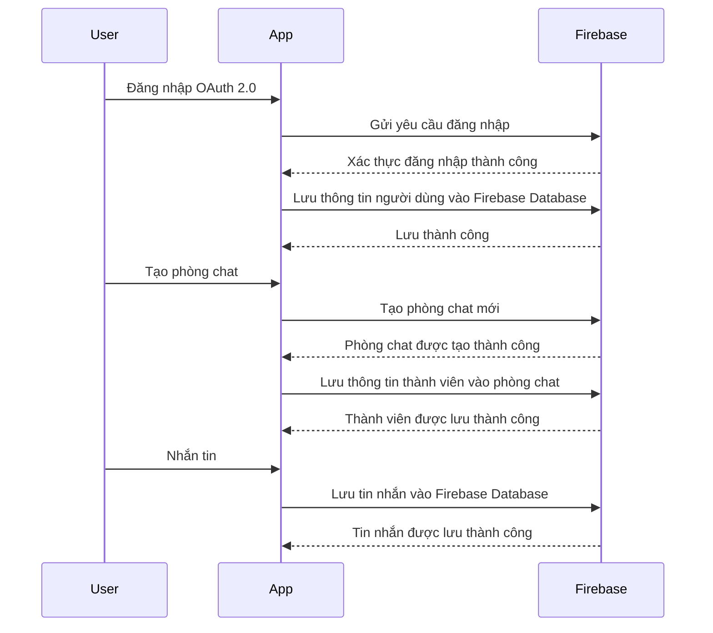

# Chat App Documentation

This is the documentation for the Chat App project. You can find the project repository on GitHub: [hungnguyen18/chat-app](https://github.com/hungnguyen18/chat-app).

## Introduction

The Chat App allows users to create chat rooms and engage in real-time conversations on various topics. It supports authentication using Google and Facebook accounts, utilizing the OAuth 2.0 protocol for secure authentication.

To understand more about OAuth 2.0, you can refer to the following resource: [What is OAuth 2.0](https://auth0.com/intro-to-iam/what-is-oauth-2).

## Features

1. Google and Facebook Authentication: Users can log in to the application using their Google or Facebook accounts, ensuring security through OAuth 2.0.
2. Create Chat Rooms: Users can create new chat rooms to initiate conversations on different topics.
3. Add Users to Chat Rooms: Users have the ability to invite and add other users to chat rooms.
4. Real-time Chat using Firebase Realtime Database: The application utilizes Firebase Realtime Database to provide real-time chat functionality.

## Technology Stack

The Chat App uses the following technologies:

- UI Library:
  - React JS: [https://react.dev/](https://react.dev/)
  - Ant Design: [https://ant.design/](https://ant.design/)
  - Styled Components: [https://styled-components.com/](https://styled-components.com/)
- Database:
  - Firebase: [https://firebase.google.com/](https://firebase.google.com/)
    - Authentication: OAuth 2.0 (Google, Facebook)
      - [Firebase Authentication Documentation](https://firebase.google.com/docs/auth/web/start)
      - [How to Set Up Firebase Authentication with React](https://hackernoon.com/how-to-set-up-firebase-authentication-with-react)
    - Database: Firestore
- Deployment: Firebase Hosting
  - Firebase Hosting Documentation: [https://firebase.google.com/docs/hosting](https://firebase.google.com/docs/hosting)

## Architecture Flow

In the architecture flow:

1. Users use the app to log in using OAuth 2.0.
2. The app sends a login request to Firebase for authentication.
3. Firebase authenticates the login and sends the successful authentication result back to the app.
4. The app stores user information in Firebase Database through Firebase.
5. Users create chat rooms within the app.
6. The app sends a request to create a new chat room to Firebase.
7. Firebase creates the new chat room and sends the successful result back to the app.
8. The app stores member information in the chat room through Firebase.
9. Users send messages within the app.
10. The app stores messages in Firebase Database through Firebase.

## Deployment

The Chat App is deployed at [https://chat-app-822db.web.app/](https://chat-app-822db.web.app/). It is deployed using Firebase Hosting.

For deployment using Firebase, you can refer to the Firebase Hosting Documentation: [https://firebase.google.com/docs/hosting](https://firebase.google.com/docs/hosting).

## Continuous Integration with GitHub Actions

The project includes a GitHub Actions workflow for automatic deployment on merge to the `main` branch. The deployment workflow is defined in the `.github/workflows/firebase-hosting.yml` file in the repository.

For more information on GitHub Actions and how to set up continuous integration, you can refer to the GitHub Actions Documentation: [Understanding GitHub Actions](https://docs.github.com/en/actions/learn-github-actions/understanding-github-actions).

Please note that the provided workflow uses Firebase service account credentials and GitHub secrets for secure deployment. Make sure to set up the required secrets and adjust the workflow according to your project's needs.

## Readme.md File

Based on the provided documentation, you can create a `readme.md` file for your project repository. The `readme.md` file will serve as a guide for users to understand the project and its functionalities.
